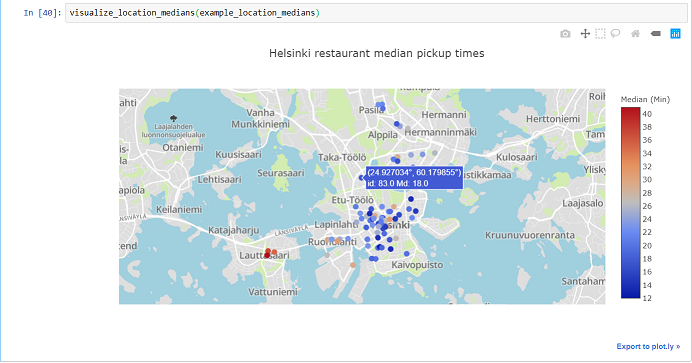

# Wolt Summer 2019 coding task

## Prerequisites

Working installation of python3 and pip.
Built on windows using anaconda python3, tested on ubuntu 18.04 with vanilla python3. 

Install packages to virtualenv, to avoid possible problems

```
pip3 install flask pandas jupyter plotly
```
Or
```
conda install flask pandas jupyter plotly
```


## Running the projects

Two ways to run the project. 

1. Jupyter notebook, which calculates the medians, produces interative visualizations of them and exports the medians
to csv file. 




2. Alternatively the vizualization can be accessed though
an small web page containing the interactive visualization, that allows
the modification of the selected timeframe. (This is horribly overkill, but I can recycle the template to other projects)


### Jupyter notebook
Navigate to cd /wolt-summer-2019 and run
```
jupyter notebook
```
Access the contents of the notebook at locationviz.ipynb
### Flask-app
Navigate to cd /wolt-summer-2019 and run

```
on linux:
export FLASK_APP=vizbackend.py
flask run
```
```
on windows:
set FLASK_APP=vizbackend.py
flask run
```
```
on windows (powershell):
$env:FLASK_APP = "hello.py"
flask run
```

Access the website at http://localhost:5000 


